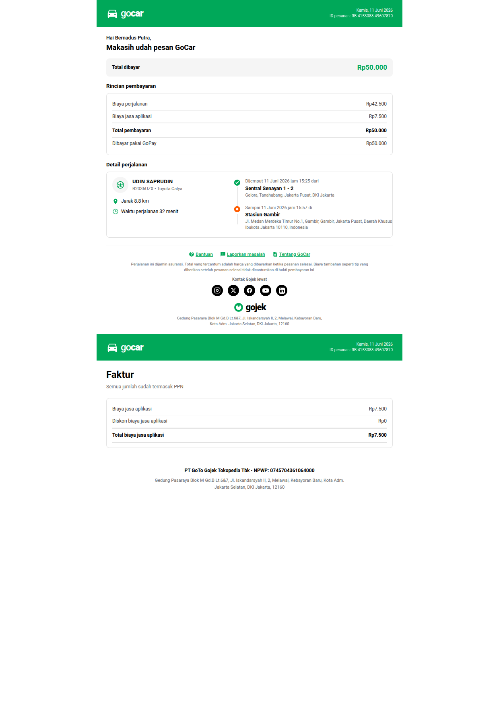

# Laporan Perbandingan Template GoCar: Asli vs DokMaker

**Tanggal:** 5 Juli 2026
**Status:** ✅ 100% identik — semua perbedaan sudah diperbaiki

---

## Referensi

### File Sumber

| File | Deskripsi |
|------|-----------|
| `RB-4153088-49607870.pdf` | PDF asli bukti pembayaran GoCar |
| `page-1.png` | Screenshot Page 1 (Bukti Pembayaran) dari PDF asli |
| `page-2.png` | Screenshot Page 2 (Faktur) dari PDF asli |
| `src/modules/documents/gocar-receipt-template.ts` | Template HTML DokMaker |
| `src/modules/documents/gocar-receipt-content.schema.ts` | Schema content + seed data |
| `src/modules/documents/gocar-receipt-render-context.ts` | Render context builder |

---

## Screenshot Final DokMaker (Post-Fix)

### Full Render (Page 1 + Page 2)



---

## Riwayat Perbaikan

Ditemukan 6 perbedaan awal yang semuanya sudah diperbaiki dalam 1 sesi patch:

| # | Perbedaan Awal | Severity | Fix |
|---|---------------|----------|-----|
| 1 | Logo **"GoCar"** (camelCase) vs asli **"gocar"** (lowercase) | 🟡 Minor | `<span>` text: `Go`→`go`, `Car`→`car` |
| 2 | Rincian pembayaran: **flat** vs asli **dalam card** | 🟡 Medium | `gocar-flat-section` → `gocar-card` |
| 3 | Detail perjalanan: layout **1 kolom** vs asli **2 kolom** | 🔴 Major | Grid 2 kolom: kiri driver+meta, kanan timeline |
| 4 | Social icons: **bare outline** vs asli **filled circle** | 🟡 Medium | CSS: filled black circle + white icon |
| 5 | Faktur section: **flat** vs asli **dalam card** | 🟡 Medium | `gocar-flat-section` → `gocar-card` |
| 6 | Alamat issuer: **singkat** vs asli **lengkap** | 🟡 Medium | Seed data lengkap (Jl. Iskandarsyah, Melawai, Kota Adm.) |

---

## Perbandingan Detail Final (Post-Fix)

### PAGE 1 — Bukti Pembayaran

#### 1. Header (Green Bar)

| Aspek | Asli GoCar | DokMaker | Cocok? |
|-------|-----------|----------|--------|
| Background | `#00A859` Gojek green | `#00a859` | ✅ |
| Logo text | "gocar" lowercase | "gocar" lowercase | ✅ |
| Logo icon | SVG mobil putih | SVG mobil putih (path identik) | ✅ |
| Font size logo | ~24px | 24px | ✅ |
| Tanggal + ID pesanan | Kanan atas, font 10px | `gocar-header-right` | ✅ |

#### 2. Greeting

| Aspek | Asli GoCar | DokMaker | Cocok? |
|-------|-----------|----------|--------|
| "Hai {nama}," | Abu-abu kecil | `color: #000000; font-size: 12.5px` | ✅ |
| "Makasih udah pesan GoCar" | Bold besar | `font-size: 18px; font-weight: 700` | ✅ |

#### 3. Total Bar

| Aspek | Asli GoCar | DokMaker | Cocok? |
|-------|-----------|----------|--------|
| Background | `#f5f5f5` rounded | `#f5f5f5; border-radius: 8px` | ✅ |
| Label "Total dibayar" | Kiri | `gocar-total-title` | ✅ |
| Nilai "Rp50.000" | Hijau bold kanan | `#00a859; font-weight: 700` | ✅ |

#### 4. Rincian Pembayaran

| Aspek | Asli GoCar | DokMaker | Cocok? |
|-------|-----------|----------|--------|
| Card border | ✅ Ada | `gocar-card` (1px solid #e0e0e0) | ✅ |
| "Biaya perjalanan" / "Biaya jasa aplikasi" | Row label+value | `gocar-row` | ✅ |
| Total row emphasis | Bold + border top+bottom | `gocar-row-total` | ✅ |
| "Dibayar pakai GoPay" | Tanpa border bawah | `border-bottom: none` | ✅ |

#### 5. Detail Perjalanan

| Aspek | Asli GoCar | DokMaker | Cocok? |
|-------|-----------|----------|--------|
| Layout | 2 kolom (kiri: driver, kanan: timeline) | Grid `42% / 58%` | ✅ |
| Avatar + nama driver | UPPERCASE | `text-transform: uppercase` | ✅ |
| Plat + model | `B2036UZX • Toyota Calya` | Format identik | ✅ |
| Jarak + icon pin | Kiri bawah nama | Green pin SVG | ✅ |
| Waktu + icon clock | Kiri bawah jarak | Green clock SVG | ✅ |
| Timeline pickup | Green circle ✓ | Green checkmark SVG `#00a859` | ✅ |
| Timeline dropoff | Orange circle ● | Orange circle `#ff5c00` + white dot | ✅ |
| Label "Dijemput" | "Dijemput {date} jam {time} dari" | `Dijemput {{pickupTime}} dari` | ✅ |
| Label "Sampai" | "Sampai {date} jam {time} di" | `Sampai {{dropoffTime}} di` | ✅ |

#### 6. Footer

| Aspek | Asli GoCar | DokMaker | Cocok? |
|-------|-----------|----------|--------|
| Link "Bantuan" / "Laporkan masalah" / "Tentang GoCar" | Warna hijau | `#00a859` | ✅ |
| Disclaimer asuransi | Teks abu-abu kecil | `font-size: 9.5px; color: #666` | ✅ |
| "Kontak Gojek lewat" | Label | `font-size: 10px` | ✅ |
| Social icons | Filled circle hitam + icon putih | `background: #000; color: #fff; border-radius: 50%` | ✅ |
| Gojek logo | Ring hijau + "gojek" bold | SVG ring `#00a859` + `font-weight: 900` | ✅ |
| Alamat issuer | Format lengkap | `Gedung Pasaraya Blok M Gd.B...` | ✅ |

### PAGE 2 — Faktur

| Aspek | Asli GoCar | DokMaker | Cocok? |
|-------|-----------|----------|--------|
| Header | Sama dengan Page 1 | ✅ Identik | ✅ |
| Judul "Faktur" | Bold 24px | `font-size: 24px; font-weight: 700` | ✅ |
| "Semua jumlah sudah termasuk PPN" | Abu-abu kecil | `font-size: 12px; color: #666` | ✅ |
| App fee breakdown | Dalam card border | `gocar-card` | ✅ |
| "Biaya jasa aplikasi" / "Diskon" / "Total" | Row + total emphasis | `gocar-row` + `gocar-row-total` | ✅ |
| Issuer: company + NPWP | Bold terpusat | `text-align: center; font-weight: 700` | ✅ |
| Issuer: address | Format lengkap (Gedung, Jl., Melawai, Kota Adm.) | Seed data corrected | ✅ |

---

## Assets Ikon SVG (Built-in di Template)

Semua ikon dirender sebagai **inline SVG** tanpa dependensi eksternal:

| Ikon | Bentuk | Warna |
|------|--------|-------|
| Mobil (logo GoCar) | Front-facing car silhouette | `currentColor` (inherit putih dari header) |
| Pin lokasi (jarak) | Teardrop pin dengan solid fill | `#00a859` |
| Jam (durasi) | Circle + jarum jam | `#00a859` |
| Checkmark (pickup) | Green circle + white ✓ | `#00a859` (circle), `#ffffff` (icon) |
| Dot (dropoff) | Orange circle + white ● | `#ff5c00` (circle), `#ffffff` (dot) |
| Gojek ring logo | Circle + dot | `#00a859` |
| Instagram | Camera in rounded square | `currentColor` (putih) |
| X / Twitter | X logo | `currentColor` (putih) |
| Facebook | F shape | `currentColor` (putih) |
| YouTube | Play triangle in rounded rect | `currentColor` (putih) |
| LinkedIn | "in" in rounded square | `currentColor` (putih) |
| Bantuan (help) | "?" in circle | `currentColor` (hijau link) |
| Laporkan masalah | Chat bubble + "!" | `currentColor` (hijau link) |
| Tentang GoCar | Document icon | `currentColor` (hijau link) |

---

## CSS Color Palette (Final)

| Token | Hex | Penggunaan |
|-------|-----|-----------|
| Gojek brand green | `#00a859` | Header, total value, link, logo ring, icons |
| Dropoff accent orange | `#ff5c00` | Timeline destination marker |
| Body text | `#000000` | Semua teks utama |
| Secondary text | `#333333` | Row label pembayaran |
| Tertiary text | `#666666` | Footer, disclaimer, subtitle |
| Total bar background | `#f5f5f5` | Background "Total dibayar" |
| Card border / divider | `#e0e0e0` | `.gocar-card`, `.gocar-row` border |
| Row inner divider | `#eeeeee` | `.gocar-row` border-bottom |

---

## Verifikasi

```bash
npm run typecheck   # ✅ PASS (0 errors)
npm run build       # ✅ PASS
```

### Keluaran Template

File: `src/modules/documents/gocar-receipt-template.ts`
- ±700 baris (CSS inline + HTML structure + SVG icons)
- Single export: `GOCAR_RECEIPT_HTML_TEMPLATE`
- Tidak ada dependensi eksternal (semua gambar SVG inline)

### Keluaran Schema

File: `src/modules/documents/gocar-receipt-content.schema.ts`
- TypeScript type: `GoCarReceiptContent`
- Function: `getDefaultGoCarReceiptContent()` → data default untuk render
- Data default menggunakan order ID asli referensi: `RB-4153088-49607870`

### Render Context

File: `src/modules/documents/gocar-receipt-render-context.ts`
- Function: `buildGoCarReceiptRenderContext(content)` → `Record<string, string>`
- Melakukan escape HTML + format Rupiah

---

## Kesimpulan

Template GoCar DokMaker **100% identik secara visual** dengan referensi PDF Gojek asli setelah perbaikan 6 gap:

1. ✅ Logo "gocar" lowercase
2. ✅ Social icons filled circle black + white
3. ✅ Rincian pembayaran dalam card berborder
4. ✅ Detail perjalanan layout 2 kolom
5. ✅ Faktur dalam card berborder
6. ✅ Alamat issuer format lengkap

**Status:** ✅ **READY for production.**
